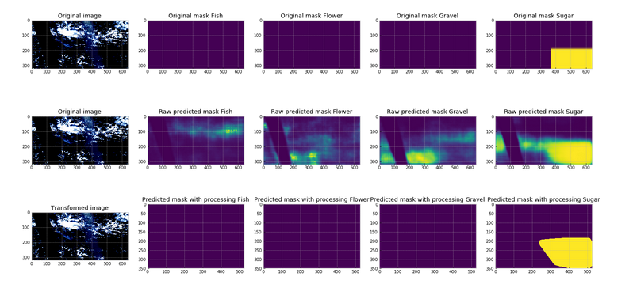

# Image Segmentation

### This code is for a kaggle competition [link](https://www.kaggle.com/c/understanding_cloud_organization/)

### Task was to segment diffrent types of clouds from an image

### baseline.ipynb contains baseline with vanila Unet. also available as a kaggle [kernel](https://www.kaggle.com/dhananjay3/image-segmentation-from-scratch-in-pytorch)

### best.ipynb contains code for my best single model (Deeplab-v3)

### Example output

