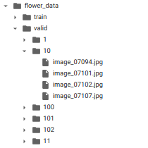

# Image classification using pretrained model
## 1) Used Pretrained Resnet and retrained it for classification task. 
## 2) Accuracy above 97%  
## 3) dataset [link](http://www.robots.ox.ac.uk/~vgg/data/flowers/102/index.html)   
## 4) dataset looks like this       
## 5) Result  
<pre>Test Loss: 0.115012

Test Accuracy of 0: 100% ( 7/ 7)
Test Accuracy of 1: 100% ( 4/ 4)
Test Accuracy of 2: 100% ( 6/ 6)
Test Accuracy of 3: 100% ( 5/ 5)
Test Accuracy of 4: 100% ( 6/ 6)
Test Accuracy of 5: 90% ( 9/10)
Test Accuracy of 6: 100% ( 5/ 5)
Test Accuracy of 7: 100% ( 5/ 5)
Test Accuracy of 8: 100% ( 1/ 1)
Test Accuracy of 9: 100% ( 7/ 7)
Test Accuracy of 10: 100% ( 2/ 2)
Test Accuracy of 11: 100% (16/16)
Test Accuracy of 12: 100% (11/11)
Test Accuracy of 13: 100% ( 4/ 4)
Test Accuracy of 14: 100% ( 6/ 6)
Test Accuracy of 15: 100% ( 7/ 7)
Test Accuracy of 16: 100% ( 4/ 4)
Test Accuracy of 17: 100% ( 8/ 8)
Test Accuracy of 18: 100% (12/12)
.
.
.
Test Accuracy of 98: 80% ( 8/10)
Test Accuracy of 99: 100% ( 6/ 6)
Test Accuracy of 100: 100% (10/10)
Test Accuracy of 101: 83% ( 5/ 6)

Test Accuracy (Overall): 97% (788/810)
</pre>
